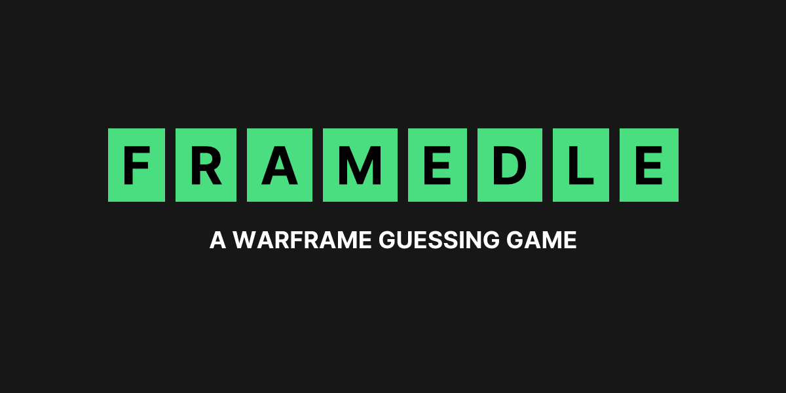
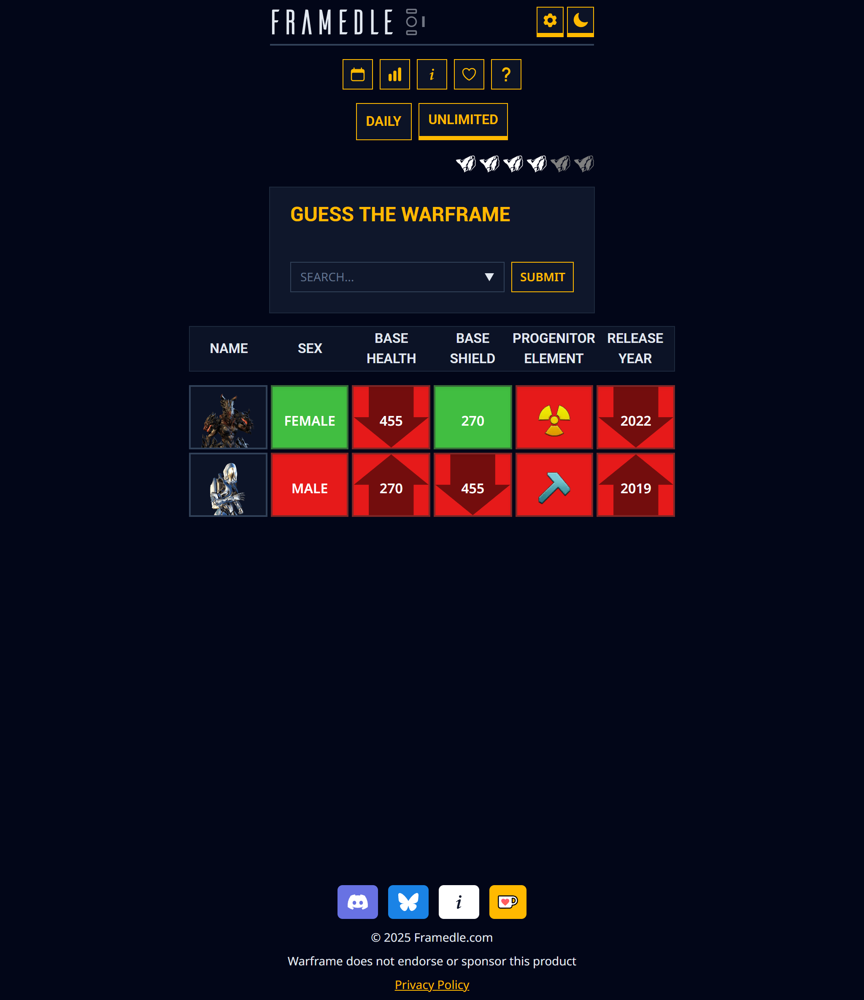
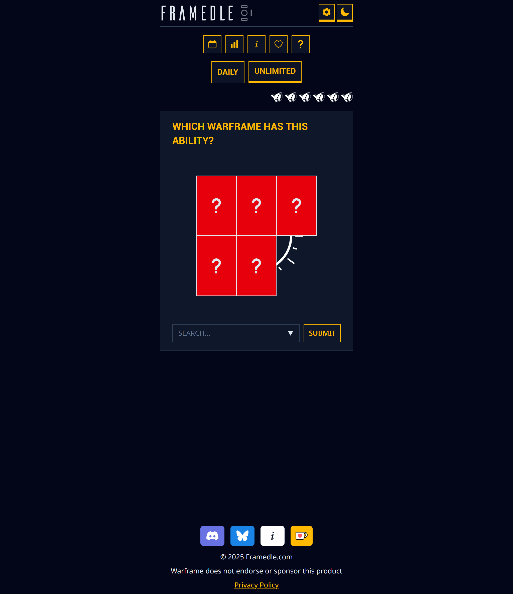
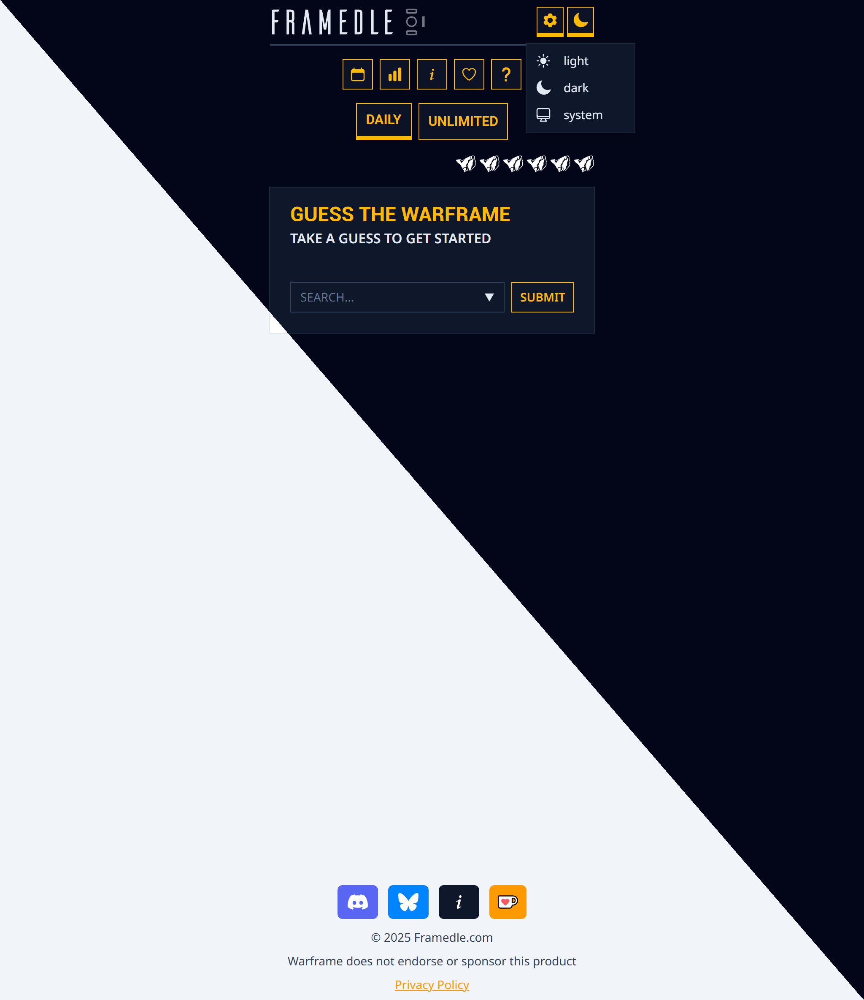
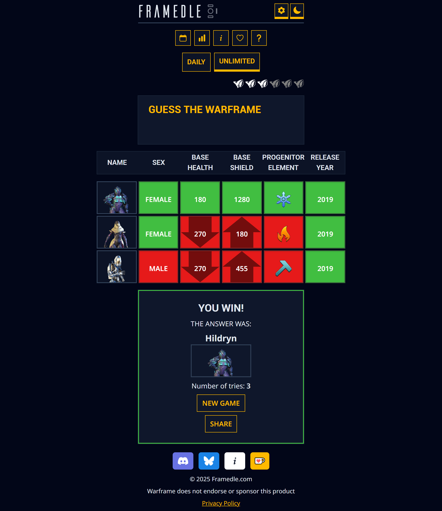

<h3 align="center">
   
   
  Guess different Warframes using the clues provided. Resets every day at midnight.
   
</h3>
 

    
    
    
  

 

## Showcase

|  |  |
| ----------------------------------------------------------------------- | ----------------------------------------------------------------------- |
|   |      |

## Built With

  
  
  
  

## Features

Major features include:

- Multiple game modes
  - Guess the Warframe based on it's stats
  - Guess the Warframe based on the image
- Shareable links for unlimited challenges
- Archives of all previous daily challenges
- Fully responsive design
  - Works on mobile, tablet, and desktop
- Light and dark mode
- Downloadable as a Web App
- Colorblind friendly colors toggle

## Sponsor

If you like this project you can support me by buying me a coffee.

